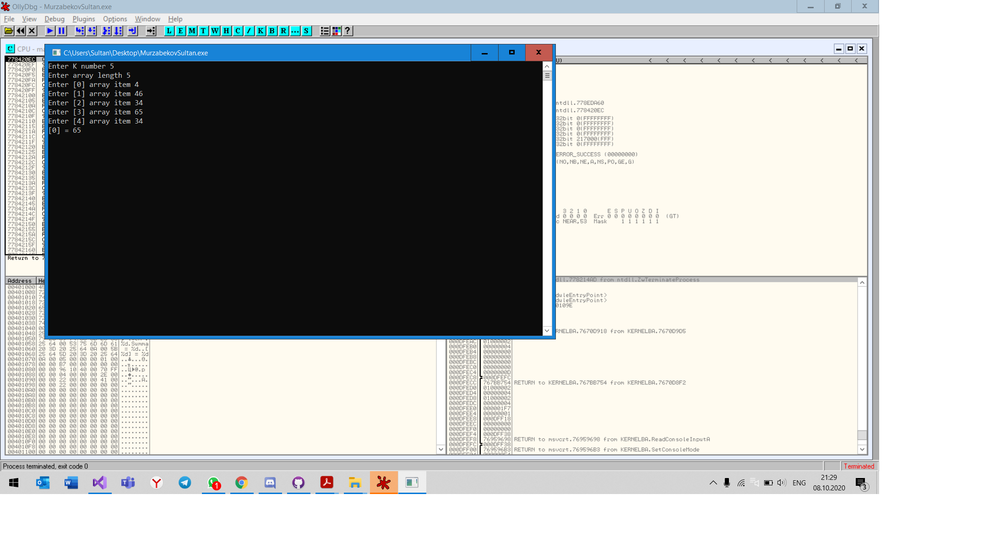

# Assembly-2020 (Архитектура вычислительных систем 2 курс)
##  БПИ195 Мурзабеков Султан. 
##  Домашнее задание №2, Вариант №6

###  Условие задания:
Разработать программу, которая вводит одномерный массив A[N], формирует из элементов массива A новый массив B по правилу: Массив Б из элементов А, значение которых кратно введённому числу x, и выводит его. Память под массивы может выделяться как статически, так и динамически по выбору разработчика.

Разбить решение задачи на функции следующим образом:
1. Ввод и вывод массивов оформить как подпрограммы.
1. Выполнение задания по варианту оформить как процедуру
1. Организовать вывод как исходного, так и сформированного массивов

Указанные процедуры могут использовать данные напрямую (имитация процедур без параметров). Имитация работы с параметрами также допустима.
Отчет:
В ходе разработки пользовался отладчиком OllyDbg
 
